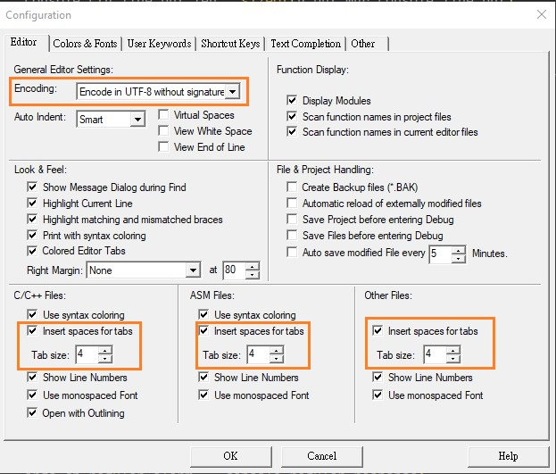
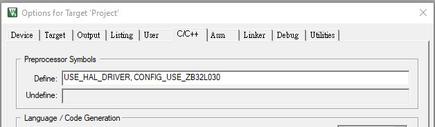
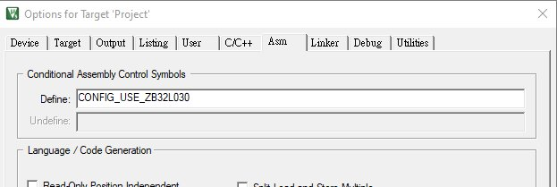
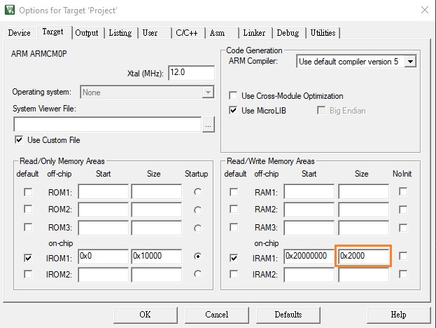

# ZB32L03x_SDK

ZB32L03x_SDK

## Keil-C Configuration

+ Set 4 Spaces to replace Tab and UTF8 encoding
    > [Edit] -> [Configuration..]

    

+ Select `Target device`
    > + `CONFIG_USE_ZB32L030`

    - [Options for Target] -> [C/C++] -> [Define]
        > Add `CONFIG_USE_ZB32L030` or the other target device

        

    - [Options for Target] -> [Asm] -> [Define]
        > Add `CONFIG_USE_ZB32L030` or the other target device

        

+ Configure SRAM size
    > + ZB32L030  => `SRAM size = 0x2000`

    - [Options for Target] -> [Target] -> [IRAM1]

        
